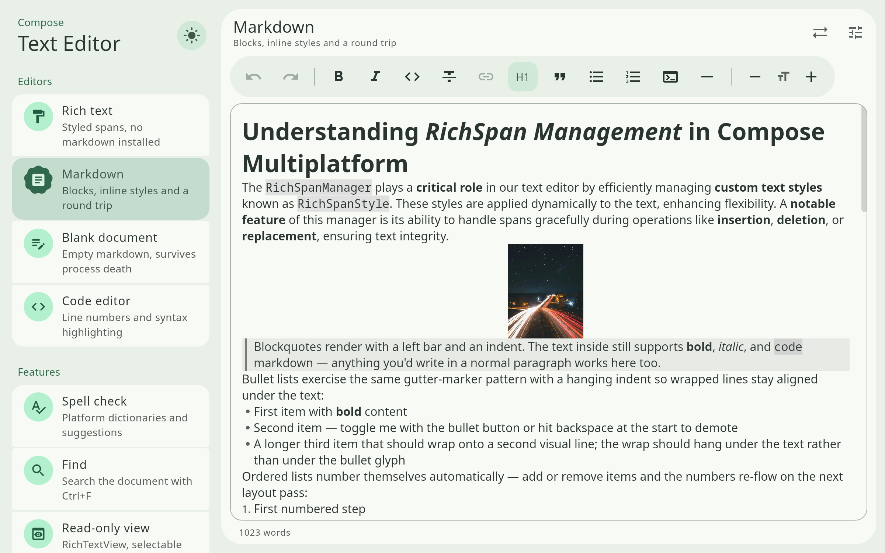

# Compose Text Editor

![badge-jvm] ![badge-android] ![badge-wasm] ![badge-ios]

Compose has been missing a **Rich Text Editor** since its inception.
I've [taken a crack](https://github.com/Wavesonics/richtext-compose-multiplatform) at this
previously, as have [others](https://github.com/MohamedRejeb/Compose-Rich-Editor).

However, they have all suffered from fundamental limitations in `BasicTextField`, the foundation of
all text entry in Compose.

This project is an attempt to re-implement text entry from scratch to finally have a
solution to the various problems.

### Why?

I've been trying to implement a [spell checking](https://github.com/Wavesonics/SymSpellKt) text
field in Compose, and keep running up against
the limitations of `BasicTextField`. Pretty much out of options, I decided to see what it might take
to replace `BasicTextField` with something that solved all of my needs.

And now, it's working, and at this point, working pretty well.

- ✅ 100% Compose Multiplatform
- ✅ Behaves like each platform's own text fields: keys, mouse, touch, IME, clipboard
- ✅ Efficient rendering and editing of long-form text
- ✅ Rich text with custom spans
- ✅ Expose scroll state
- ✅ Spell checking
- ✅ Decoration layers: your own highlights (find, syntax colours) kept out of undo and export
- ✅ Screen readers
- ✅ Diagnostics from your own checker (grammar, style), underlined with a menu of fixes
- ✅ Block structure: headings, nested lists, blockquotes, code fences, rules, images, links
- ✅ HTML import, export and clipboard
- ☑️ Markdown, as an addon (CommonMark, partial)
  - Inline styles (bold, italics, etc.)
  - Block styles (code fence with its language tag, nested lists, images)
  - Underline (`<u>`), highlight (`==text==` or `<mark>`), colour and size (``)
  - Opt-in shortcuts that format as you type (`# `, `- `, `**bold**`)

You can [Give it a try here](https://darkrock-studios.github.io/ComposeTextEditor/), or
browse
the [API reference & recipes](https://darkrock-studios.github.io/ComposeTextEditor/api/).

### Features:

- Rich text rendering and editable
  - Only what is visible is drawn, and lines are stored in chunks
  - A long document lays out the viewport first and settles the rest between frames:
    a 200,000 character document loads in about 7 ms on desktop
- Keyboard, mouse and touch behave like the platform's own text fields: grapheme-aware
  caret and word motion, multi-click selection, the platform's shortcuts (macOS's
  Emacs-style chords, Linux's primary selection, shortcuts that follow the active
  keyboard layout), touch handles, magnifier and toolbar, and right-to-left text
- Input methods: dead keys, CJK composition, autocorrect, and on Android stylus
  handwriting and keyboard GIFs and stickers (handed to the host)
- Clipboard with rich text (HTML) on every platform, paste as plain text, and drag and
  drop on desktop, Android and the web
- Undo and redo, one step per user action, with an API to group your own edits
- Paragraph formatting: spacing, alignment, indents and line height
- Exposed scroll state, so we can render scroll bars (_BTF1 can't do this_)
- Doesn't copy and return full contents on each edit, so again better for longer form text. (_BTF2
  also works this way, but BTF2 doesn't support AnnotatedString for rich content_)
- Support custom Rich Span drawing (_this allows us to render the traditional Spell Check red
  squiggle_)
- Emits edit events: so if a single character is inserted, you can collect a Flow, and know exactly
  what change was made. This makes managing Spell Check much more efficient as you can just
  respell-check the single word that was changed, rather than everything. (_BTF2 now finally offers this!_)
- Decoration layers: host-owned spans for highlights such as find matches, spell check
  or syntax colours, which stay out of undo, copies, exports and the text revision.
- Find & Replace UI: case, whole word, regex, within the selection, F3 and Ctrl+G.
- Spell check menu with suggestions, Ignore and Add to dictionary.
- Screen reader support: the editor and `RichTextView` publish their text, selection,
  links and clipboard actions as `BasicTextField` does, with character bounds on
  Android and iOS.
- Word count, by the same word segmentation as word motion and spell check.
- `rememberSaveableTextEditorState`: the document, caret, selection and scroll survive
  configuration changes and process death (the undo history does not).
- `TextEditorState(initialText)`: a view model can create, load and edit the document
  outside composition, and hand it to the editor later.
- Editor configuration: read-only with a caret, sizing to the text between minimum
  and maximum lines, single line (one row that scrolls sideways), maximum length and
  input filters, and wrapping off (`softWrap = false`) for code: each line one row,
  the editor scrolling sideways.
- Opt-in writer conveniences: smart punctuation (curly quotes and apostrophes, em
  and en dashes, ellipses), each substitution switchable, and auto-linking of typed
  and pasted URLs, each undone in one step
  ([docs/design/behaviors.md](docs/design/behaviors.md)).

#### Platforms

| Platform | Status |
| --- | --- |
| Desktop (JVM) | Supported |
| Android | Supported |
| iOS | Beta: typing, autocorrect, CJK composition, the edit menu, loupe and touch handles |
| WASM | Beta: typing, IME composition, the rich clipboard and drag and drop |

## Want to try it?

Text Editor:

`implementation("com.darkrockstudios:composetexteditor:3.0.0")`

Markdown addon, to use the editor as a markdown editor (`state.withMarkdown()`):

`implementation("com.darkrockstudios:composetexteditor-markdown:3.0.0")`

Spell Checking addon:

`implementation("com.darkrockstudios:composetexteditor-spellcheck:3.0.0")`

Find & Replace addon:

`implementation("com.darkrockstudios:composetexteditor-find:3.0.0")`

Upgrading from 2.x (markdown as its own module, decoration layers,
shortcuts matched on the keyboard layout): see [docs/MIGRATION.md](docs/MIGRATION.md).
How the editor is built is in [docs/ARCHITECTURE.md](docs/ARCHITECTURE.md), and how it is
tested in [docs/TESTING.md](docs/TESTING.md).

On iOS, host the Compose view with `.ignoresSafeArea(.keyboard)` in SwiftUI, as the
Compose Multiplatform template does. The editor keeps its caret above the keyboard itself;
letting SwiftUI shrink the view as well moves the content twice.

On Android, declare `android:windowSoftInputMode="adjustResize"` on the activity, as
Compose apps should; otherwise Android also pans the whole window to the caret. The
editor keeps its caret in view whether the host pads it by the keyboard's inset
(`imePadding`) or lets the keyboard cover it. `TextEditorState.keyboardSettings` asks the
keyboard for its capitalisation, autocorrect, layout and action key; an editor for code
would turn capitals and autocorrect off. Android, iOS and the web honour it; the web
ignores autocorrect.

## Really?

I don't know. Maybe. It might not be a permanent solution.
`BasicTextField2`'s new state based approach and gap-buffer has reached maturity and includes a lot of what I would need
to replace this, but still cannot handle rich text rendering.
So until that is solved, this is the only solution that I am aware of that ticks every box.

[badge-android]: http://img.shields.io/badge/-android-6EDB8D.svg?style=flat

[badge-jvm]: http://img.shields.io/badge/-jvm-DB413D.svg?style=flat

[badge-js]: http://img.shields.io/badge/-js-F8DB5D.svg?style=flat

[badge-js-ir]: https://img.shields.io/badge/support-[IR]-AAC4E0.svg?style=flat

[badge-linux]: http://img.shields.io/badge/-linux-2D3F6C.svg?style=flat

[badge-windows]: http://img.shields.io/badge/-windows-4D76CD.svg?style=flat

[badge-wasm]: https://img.shields.io/badge/-wasm-624FE8.svg?style=flat

[badge-wasmi]: https://img.shields.io/badge/-wasi-626FFF.svg?style=flat

[badge-jsir]: https://img.shields.io/badge/-js(IR)-22D655.svg?style=flat

[badge-apple-silicon]: http://img.shields.io/badge/support-[AppleSilicon]-43BBFF.svg?style=flat

[badge-ios]: http://img.shields.io/badge/-ios-CDCDCD.svg?style=flat

[badge-ios-sim]: http://img.shields.io/badge/-iosSim-AFAFAF.svg?style=flat

[badge-mac-arm]: http://img.shields.io/badge/-macosArm-444444.svg?style=flat

[badge-mac-x86]: http://img.shields.io/badge/-macosX86-111111.svg?style=flat

[badge-watchos]: http://img.shields.io/badge/-watchos-C0C0C0.svg?style=flat

[badge-tvos]: http://img.shields.io/badge/-tvos-808080.svg?style=flat
